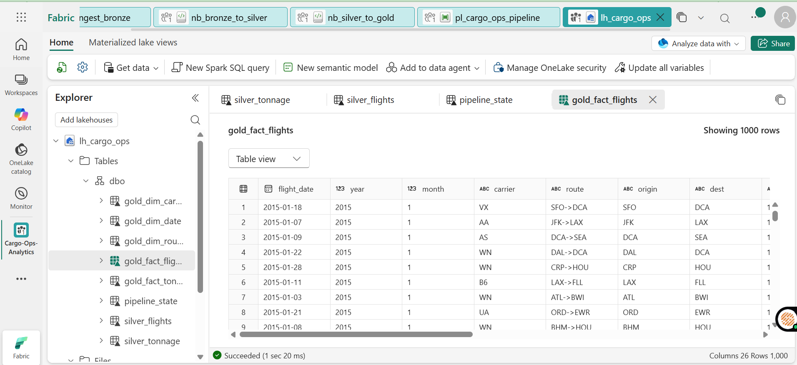
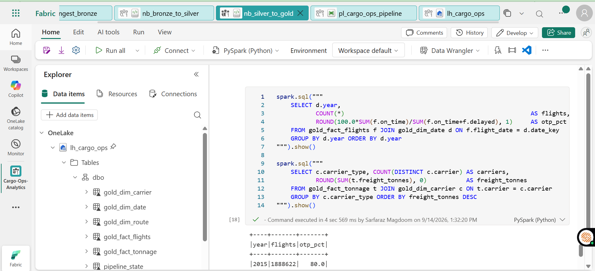
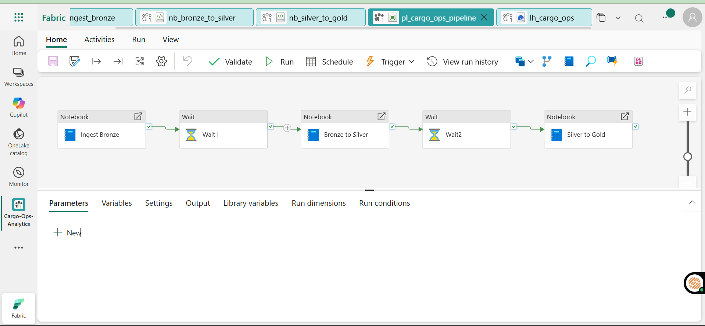
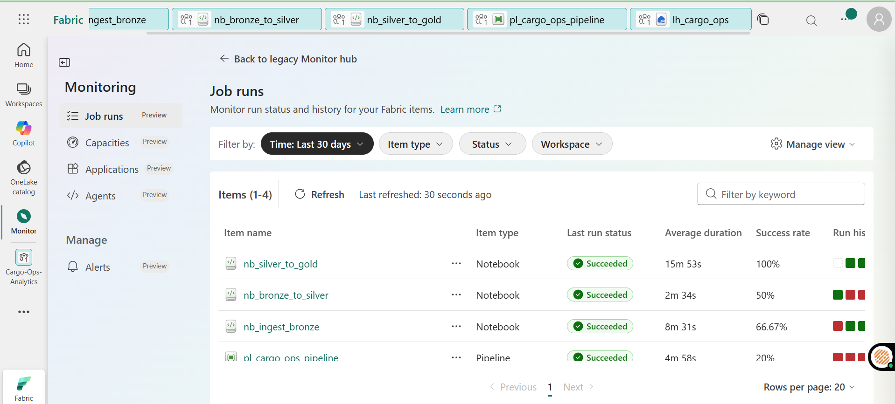

# Cargo Lakehouse on Microsoft Fabric

A medallion lakehouse for air cargo data, built in PySpark on Microsoft Fabric.
It extends my [Cargo Operations Dashboard](https://github.com/sarfaraz-magdoom/cargo-ops-dashboard) from a local Python pipeline to a cloud lakehouse.

## Status

- ✅ Bronze layer: raw files loaded into Delta tables
- ✅ Silver layer: cleaned, typed and deduplicated
- ✅ Gold layer: fact and dimension tables (star schema)
- ✅ Data pipeline: runs the notebooks in order
- ⏳ Power BI semantic model (Direct Lake)
- ⏳ Report

## How it flows

```
Source files -> Bronze (raw Delta) -> Silver (clean Delta) -> Gold (star schema) -> Semantic model (next)
```

## What each layer does

**Bronze** - [e.g. loads the raw CSV files as-is and adds load date and source file columns]

**Silver** - [e.g. fixes data types, removes duplicates, standardises airport and carrier codes, handles nulls]

**Gold** - [e.g. builds fact_movements plus dim_date, dim_airport and dim_carrier]

## Data

[Source name and link]. About [X]M rows. Raw data isn't in this repo.

## Screenshots






## Repo layout

```
notebooks/bronze   notebooks/silver   notebooks/gold
pipeline/pipeline.json
images/
```

## Tech

Microsoft Fabric, PySpark, Delta Lake, Data Pipelines
